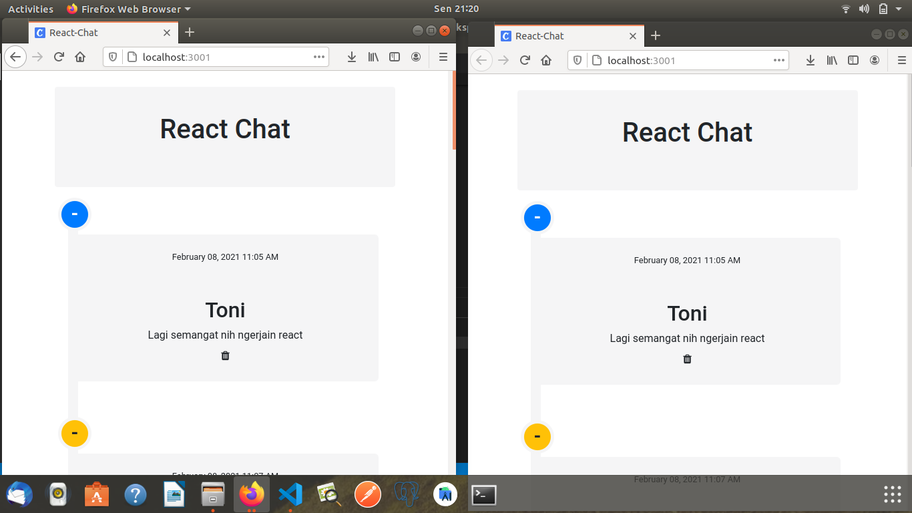
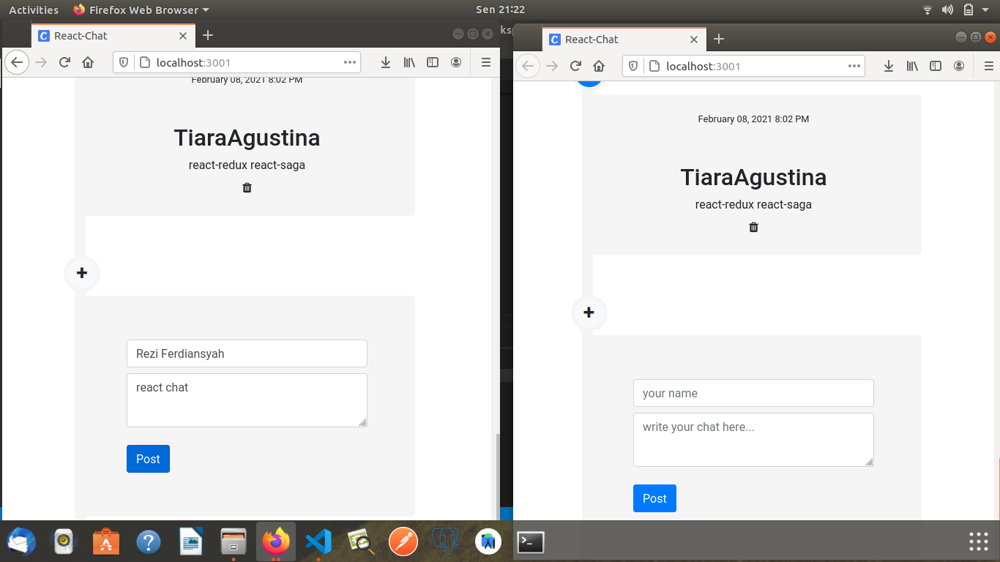
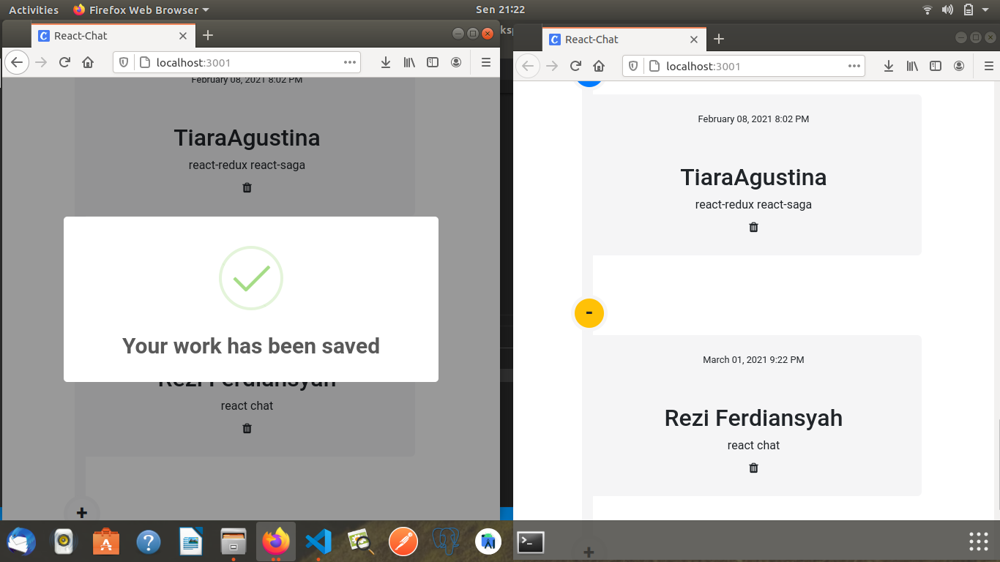
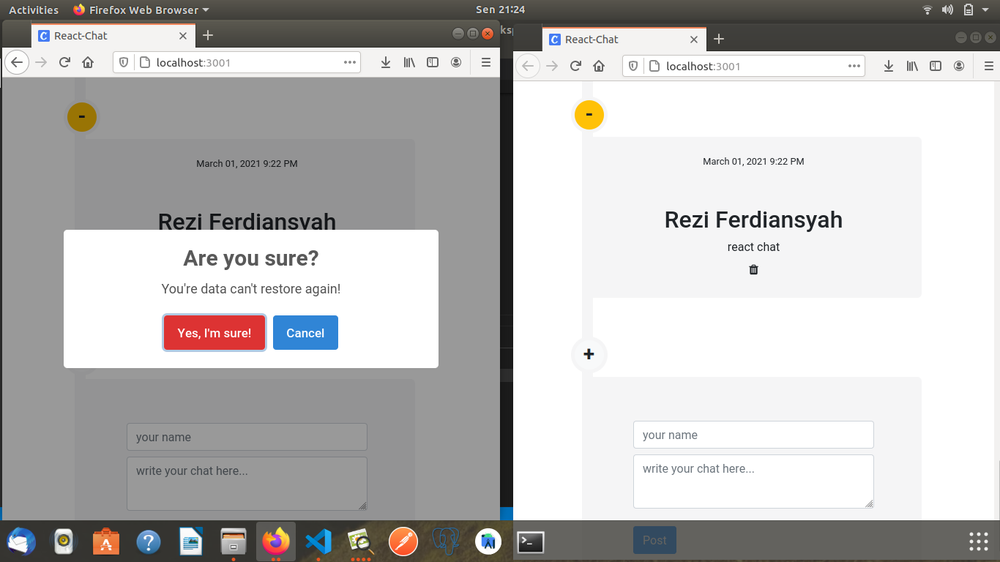
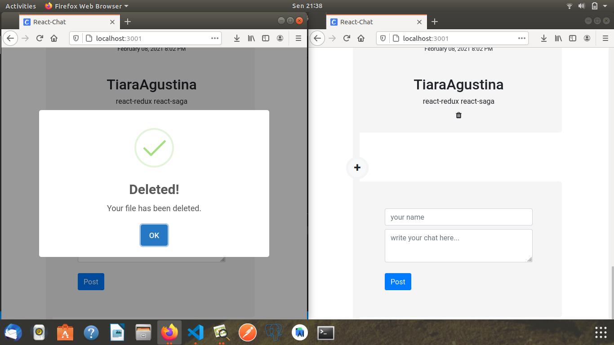

# SIMPLE REACT CHAT APPS

Stack technologies :

- Node.js (express)
- React redux-saga
- Socket IO
- Mongodb
- NPM (others package)
- Bootstrap 4.0 (View)

 DISPLAY 1

 DISPLAY 2 POST CHAT

 DISPLAY 3 SUCCESSFUL POST CHAT 

 DISPLAY 4 DELETE CHAT 

 DISPLAY 5 SUCCESSFUL DELETE CHAT 

